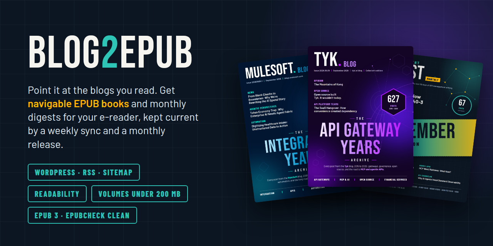
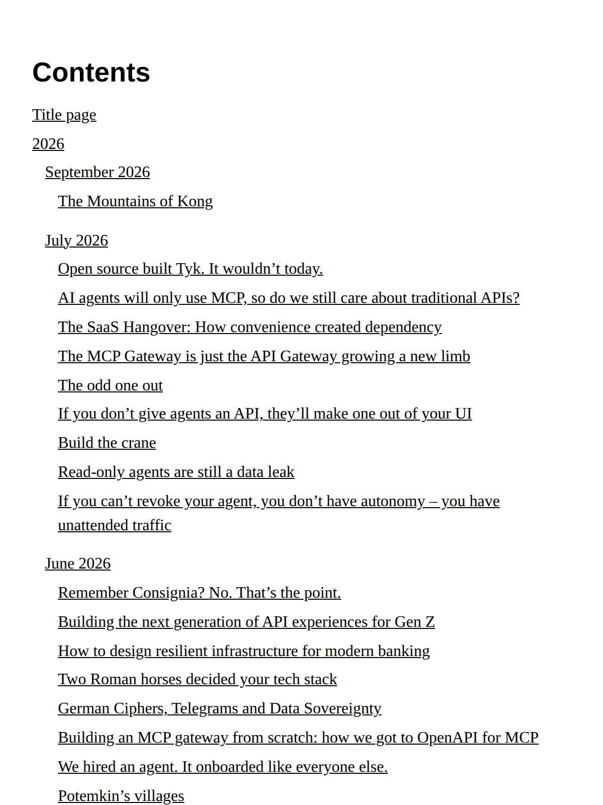
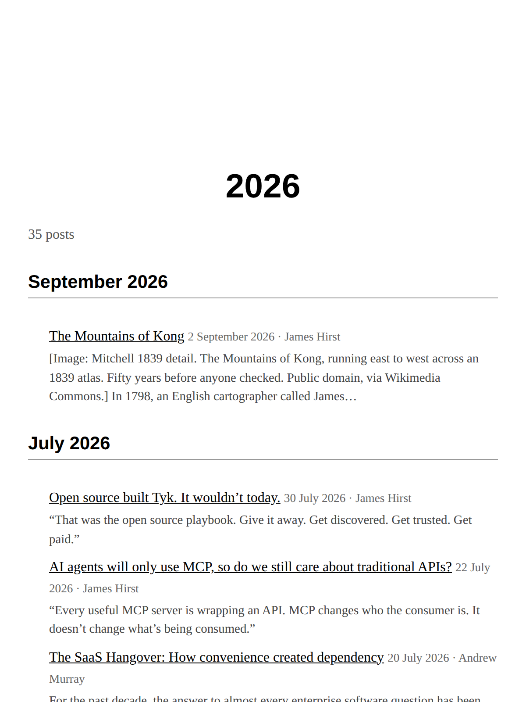
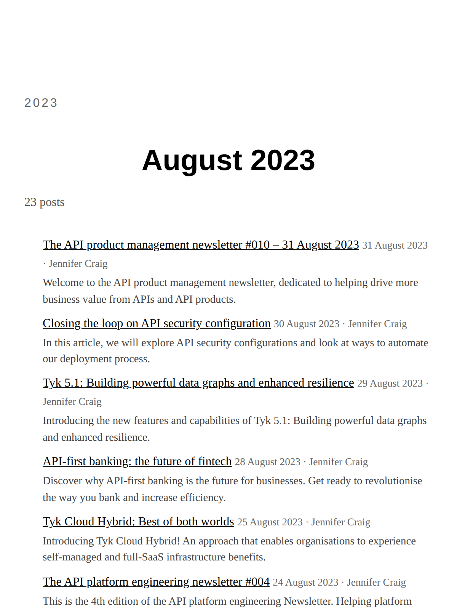
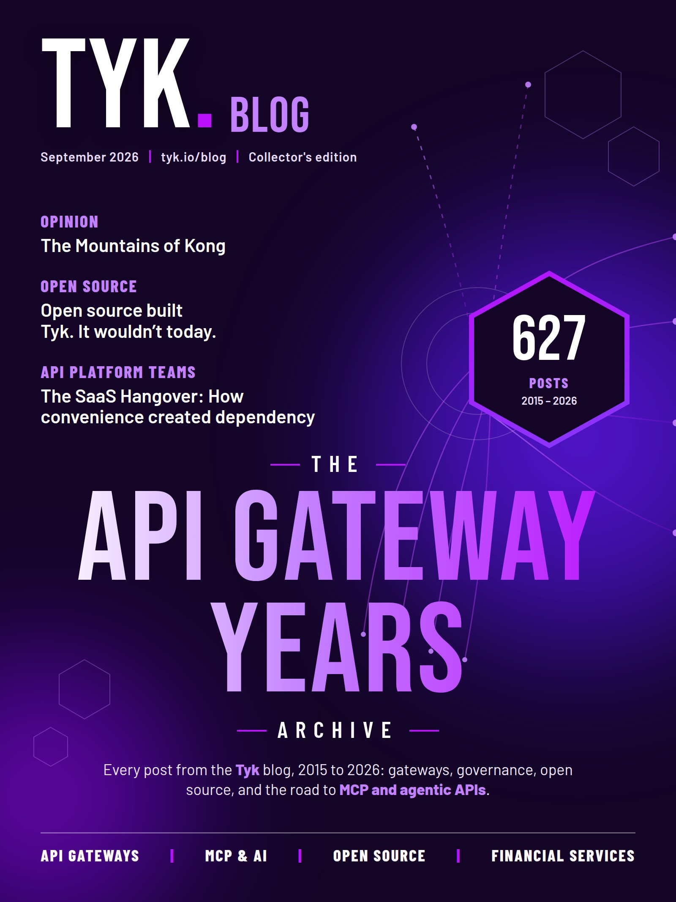
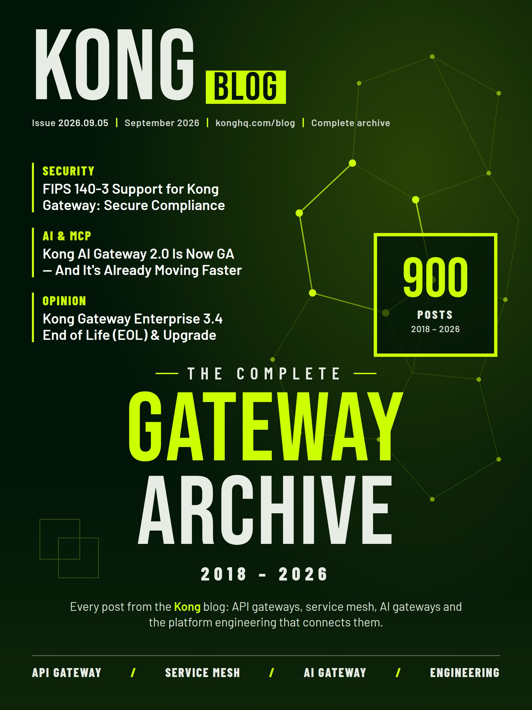
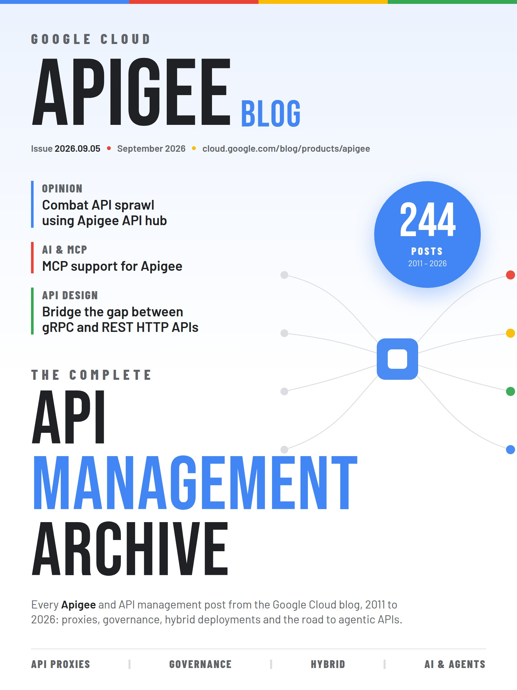
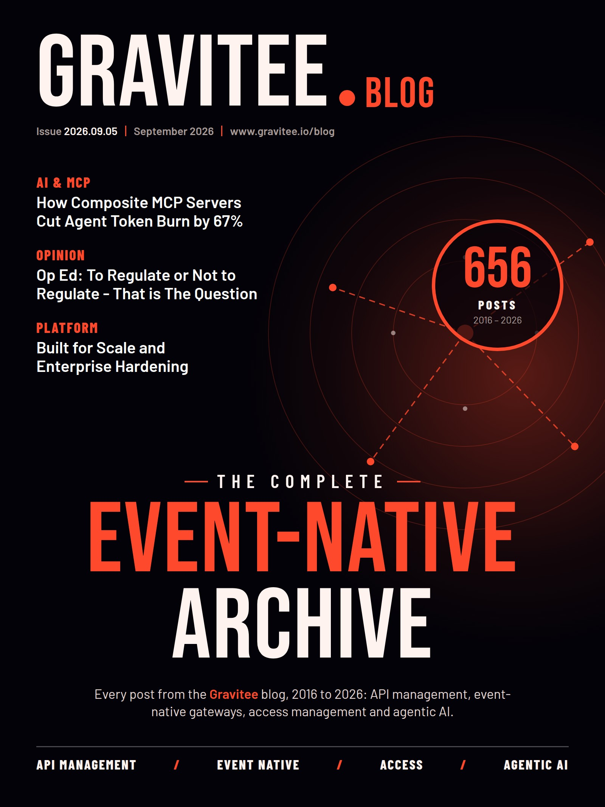
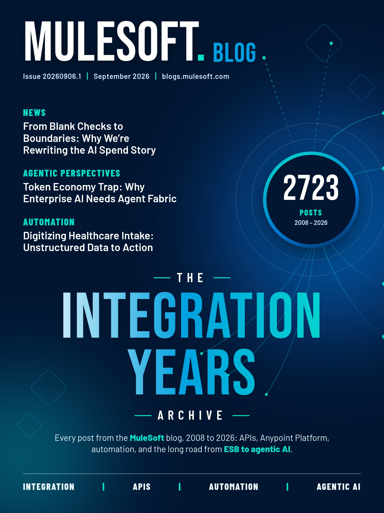
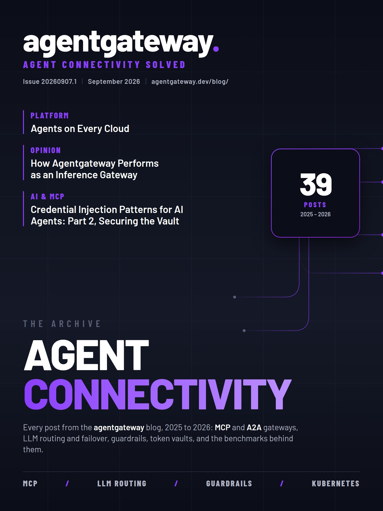

<p align="center">
  
</p>

<h1 align="center">blog2epub</h1>

<p align="center">
  Point it at the blogs you read. Get navigable EPUB books and monthly digests for your e-reader, kept current by a weekly workflow.
</p>

<p align="center">
  <a href="https://github.com/jaydotsee/blog2epub/actions/workflows/ci.yml"></a>
  <a href="https://github.com/jaydotsee/blog2epub/actions/workflows/sync.yml"></a>
  <a href="https://github.com/jaydotsee/blog2epub/releases"></a>
  
  
  <a href="LICENSE"></a>
</p>

<p align="center">
  <a href="#quick-start">Quick start</a> ·
  <a href="#configuration">Configuration</a> ·
  <a href="#the-api-management-digest">The digest</a> ·
  <a href="#keeping-books-current-with-github-actions">Automation</a> ·
  <a href="https://github.com/jaydotsee/blog2epub/releases">Download books</a> ·
  <a href="CHANGELOG.md">Changelog</a>
</p>

---

**blog2epub** monitors blogs, caches every post, and writes EPUB 3 files with a cover, a title
page, a nested table of contents with excerpts, readability-cleaned articles with their images,
and cross-links that stay inside the book. A book can be one blog's complete archive or a
magazine-style digest that combines several blogs over a date range. Every book it produces passes
the W3C [epubcheck](https://github.com/w3c/epubcheck) with zero errors and warnings.

It ships configured with eight books: seven complete archives — [Tyk](https://tyk.io/blog)
(627 posts), [Kong](https://konghq.com/blog) (900 posts),
[Apigee](https://cloud.google.com/blog/products/apigee) (244 posts),
[Axway](https://blog.axway.com) (1,968 posts, back to 2011),
[Gravitee](https://www.gravitee.io/blog) (656 posts) and
[MuleSoft](https://blogs.mulesoft.com) (2,505 posts, back to 2008) and
[agentgateway](https://agentgateway.dev/blog/) (39 posts) — and the
**API Management Digest**, a monthly issue drawn from twelve API-management blogs. All are
published on the [releases page](https://github.com/jaydotsee/blog2epub/releases).

The idea comes from Facundo Olano's [Turn your blog into a book](https://jorge.olano.dev/blog/turn-your-blog-into-an-ebook/):
an EPUB is zipped XHTML plus a manifest. That post builds a book from a blog's *own source files*.
blog2epub does the same for blogs you **don't** own, by fetching posts through whatever the site
exposes.

## What it looks like on the reader

<p align="center">
  
  
  
  
</p>
<p align="center"><sub>Contents · year page · month page · chapter. Rendered at a 6-inch e-reader viewport from the generated Tyk book.</sub></p>

## Contents

- [Features](#features)
- [How it works](#how-it-works)
- [Quick start](#quick-start)
- [Commands](#commands)
- [Configuration](#configuration)
- [Site rules](#site-rules)
- [Recipes](#recipes)
- [The API Management Digest](#the-api-management-digest)
- [Magazine covers](#magazine-covers)
- [Publishing with GitHub Actions](#publishing-with-github-actions)
- [Reading the books](#reading-the-books)
- [Project layout](#project-layout)
- [Development](#development)
- [Troubleshooting](#troubleshooting)
- [Limitations](#limitations)
- [Contributing and license](#contributing-and-license)

## Features

- **Three ways in, picked automatically.** WordPress REST API (full HTML, dates, authors,
  categories, featured images), RSS/Atom feeds (with a page fetch when the feed is truncated),
  and `sitemap.xml` crawling. The richest one that answers wins.
- **Incremental monitoring.** Each sync lists what the source knows, fetches only new and
  modified posts plus missing images, and keeps everything in a per-blog cache. Building is
  offline. Requests retry with backoff, image downloads get a second attempt, and one unreachable
  blog never stops the others.
- **Readability.** Scraped pages go through readability to isolate the article. An optional
  build-time pass cleans feed and API bodies too, with a safety net that never drops a post's
  content.
- **Site rules, Calibre-recipe style.** Per blog, `keep` names the article container and
  `remove` lists the clutter to drop, as CSS selectors. `extra_css` tunes the look.
- **E-reader-sized images.** Every build downscales images to `max_image_width` and re-encodes
  them, flattening heavy transparent PNGs onto white. Blogs serve images sized for desktop
  retina screens; without this step a complete archive is several times larger than it needs to
  be (Kong: 705 MB as served, 236 MB built).
- **Clean, valid XHTML.** Scripts, styles, forms, tracking attributes, Word pastes, lazy-load
  placeholders and custom elements are handled. Every generated book passes epubcheck with zero
  errors and warnings.
- **Real navigation.** EPUB 3 `nav.xhtml` with parts (per year, month or blog), optional month
  sub-sections inside each year, and chapters; a `toc.ncx` for older readers; landmarks; and
  part pages that list each post with its date, author and excerpt.
- **Magazine digests.** Combine any number of blogs into one book, newest first, with a lead
  image per article and the blog name in every byline. Rolling windows (`since: 7d`, `1m`, `1y`)
  give a fresh issue on every build.
- **Volumes that fit a reader.** A book is cut into one volume per year by default (or by
  month, or only where a 200 MB budget says — Send to Kindle's limit, which no volume exceeds
  either way); each volume is `<book>-<issue>.<n>.epub` with its own cover and navigation.
- **Covers with live cover lines.** HTML templates rendered once per volume, with that volume's
  newest post titles, post count, year span and issue number. Or point `cover:` at your own image.
- **Scriptable, published by hand.** A plain CLI, a JSON report, and a GitHub Actions workflow
  you run when you want an issue out: every book to its own dated tag plus a `<book>-latest`
  that always holds the newest. A weekly job keeps the download cache warm and publishes nothing.

## How it works

```
blogs.yaml
  blogs: sources          books: outputs
      │                       │
      ▼                       ▼
  ┌────────┐   cache/<blog>/   ┌────────┐
  │  sync  │ ───────────────▶ │ build  │ ───▶ output/<book>.epub
  └────────┘   index.json     └────────┘        (or <book>-<year>.epub)
      │        posts/*.json        │
      │        images/*            └─ select (since/until/max_posts) → sort → group into parts
      │                               → readability pass → clean to XHTML → resolve images/links
      └─ detect source:               → render cover, title, nav, ncx, parts, chapters → zip
         1. WordPress REST API
         2. RSS / Atom feed (+ page fetch + readability when truncated)
         3. sitemap.xml (+ readability, meta and JSON-LD for dates and authors)
```

**Sources.** For every blog, `sync` tries the WordPress REST API first (`/wp-json/wp/v2/posts`),
then the feed advertised in the page or at the usual paths, then the sitemap from `robots.txt`.
The choice is remembered in the cache. WordPress is by far the best source: tyk.io's 627 posts
arrive in seven requests with rendered HTML and full metadata. Feeds usually carry only the latest
ten or so posts, so a feed-only blog fills its cache over time as the monitor keeps running.
Sitemaps list whole archives but need readability to extract each page.

**Cache.** `cache/<blog>/index.json` records every known post (URL, title, dates) and every image
(or the reason it failed). Posts live one per JSON file, images by URL hash. A post is re-fetched
only when the source reports a newer `modified` stamp. Posts that disappear from the source stay
cached unless you pass `--prune`. Transient image failures are retried after three days;
permanent ones (404, not an image, too large) only with `--full`.

**Cleaning.** Post HTML becomes a well-formed XHTML fragment: iframes and videos turn into links,
the best `srcset` candidate not wider than `max_image_width` is chosen, lazy-load `data-src`
attributes win over placeholders, inline wrappers around block content are unwrapped, unknown and
custom elements are unwrapped, invalid hrefs and ids are dropped, headings are demoted so the post
title is the only `h1`, and links to other posts in the same book are rewritten to chapter files.

**Books.** A book is one or more blogs plus a selection and a layout. Every blog builds its own
book unless it sets `standalone: false`; the `books` list adds combined ones. Chapters open with
the post's featured image when the body does not already contain it, and each part page lists its
posts with date, author, blog and excerpt.

## Quick start

Five minutes from a clone to a book on your reader. The project is managed with
[uv](https://docs.astral.sh/uv/), which will fetch a Python for you if you have none.

**1. Get it.**

```bash
git clone https://github.com/jaydotsee/blog2epub.git
cd blog2epub
uv sync --all-extras          # .venv from uv.lock: blog2epub, every extra, the dev tools
```

`make setup` is the same thing. That is the whole install — image downscaling, EPUB packaging and
every source are in the base dependencies.

**2. See what is configured.**

```bash
bin/blog2epub list
```

`bin/blog2epub` runs the CLI through uv from any directory, with no environment to activate; a
fresh clone builds `.venv` on first use. Inside the checkout, `uv run blog2epub ...` is identical.
Seven books ship configured, so you have something to build before you have written any config.

**3. Build one.**

```bash
bin/blog2epub -v run tyk        # sync, then build
```

`run` is `sync` (fetch what is new into `cache/`) followed by `build` (write the EPUBs). The first
run of a complete archive fetches every post and image, so it takes minutes — the Tyk blog is 627
posts, MuleSoft's nineteen years are about two hours. Every run after that fetches only what
changed. `-v` shows each post as it arrives.

You end up with one file per year in `output/`:

```
output/tyk-20260906-2026.epub      output/tyk-20260906-2025.epub      ...
```

**4. Read it.** Copy a volume to your e-reader, or email it to your Kindle — every volume is kept
under the 200 MB Send to Kindle accepts. Each is EPUB 3 with a cover, a nested table of contents
and the articles' own images.

**Want your own blog in there?** `bin/blog2epub detect <url>` prints a config entry to paste into
`blogs.yaml`; [Adding a blog](#adding-a-blog) below and `AGENTS.md` cover the rest.

### Optional extras

Nothing here is needed to produce a valid book. Where a piece is missing, the build says what it
fell back to and carries on.

| For | Install | Without it |
| --- | --- | --- |
| Magazine covers rendered from the HTML templates | `uv run playwright install chromium` (once), or set `CHROMIUM_PATH` | The committed `covers/<id>.jpg` is used instead |
| Rasterising SVG diagrams, which Kindle cannot display | two halves: the `svg` extra's cairosvg (already installed by `uv sync --all-extras`) **and** the cairo library it binds to, which pip cannot install — `brew install cairo` on macOS, `apt install libcairo2` on Debian and Ubuntu | SVGs are kept as they are, and Kindle shows a blank. The build says which half is missing |
| `make epubcheck`, the validator test | Java 11+ | The books are still EPUB 3; you just are not checking them |

Python 3.10 or newer. `uv sync --all-extras` already installs the Python-side extras.

### Everyday commands

```bash
bin/blog2epub run tyk                 # sync + build one book
bin/blog2epub run api-management      # sync its twelve blogs, build the monthly digest
bin/blog2epub sync                    # fetch for every blog, build nothing
bin/blog2epub build mulesoft          # build from the cache, fetch nothing
bin/blog2epub status                  # cache and output state
make check                            # ruff, mypy, pytest
```

### Scheduling with cron

`bin/publish` is the cron entry point: one book (or blog) per line, each on its own schedule.
It syncs, builds whatever changed, logs to `logs/<ids>-<date>.log` with a one-line summary in
`logs/publish.log`, finds uv even from cron's bare `PATH`, and serialises on the download cache
so two entries that overlap queue rather than fetch alongside each other.

```crontab
# m  h  dom mon dow  command
0    6  *   *   1    /home/you/blog2epub/bin/publish tyk
30   6  *   *   1    /home/you/blog2epub/bin/publish kong
0    7  1   *   *    /home/you/blog2epub/bin/publish --force api-management
```

`--force` rebuilds even when nothing new was fetched (a rolling digest wants that), `--full`
re-fetches everything, `--issue YYYYMMDD` pins the issue date, `--jobs N` sets how many blogs
sync at once, and `--set KEY=VALUE` overrides any config value for that run. The exit code is
blog2epub's: `2` when a blog failed, with the other books still built.

### Adding a blog

Run the probe: it reports every source that answers and how many posts each lists, the URL shape,
candidate extraction rules, a real extraction of five posts with a check for other posts leaking
in, the site's brand colours, and a draft config entry.

```bash
uv run scripts/probe_blog.py https://example.com/blog
```

`AGENTS.md` explains what to do with the answers and the traps to avoid; the `/add-blog` skill
walks the whole path from URL to published release. For a quick look at just the source:

```
$ bin/blog2epub detect https://konghq.com/blog
source: feed (https://konghq.com/feed/)
posts:  10
  2026-09-03T15:02:11+00:00  Kong Gateway Now Supports FIPS 140-3  https://konghq.com/blog/product-releases/kong-gateway-fips-140-3

suggested blogs.yaml entry:

  - id: konghq
    title: "..."
    url: https://konghq.com/blog
    source: feed
    include:
      - "^https://konghq\\.com/blog/"
```

Paste the entry into `blogs.yaml`, set a title, and run `blog2epub run konghq`.

## Commands

Every command accepts `-c FILE` (default `./blogs.yaml`), `-v` / `-vv` for progress output, and
`--set KEY=VALUE` to override any config value for that one run (see
[Overriding the config](#overriding-the-config)).

| Command | What it does |
| --- | --- |
| `list` | Show configured blogs and books, with cached post counts. |
| `detect URL [--source S] [--sample N]` | Probe a URL, report which source works, list posts, print a config entry. |
| `sync [ids] [--full] [--prune] [--jobs N]` | Fetch new and changed posts and their images into `cache/`. Ids can be blogs or books (the book's blogs are synced). `--full` re-fetches everything and retries failed images. `--jobs` sets how many blogs sync at once (default 4); blogs on the same host still take turns. |
| `build [ids] [--issue YYYYMMDD] [--collectors] [--report FILE]` | Write EPUB(s) from the cache. Works offline (a cover URL is fetched once). `--issue` pins the issue date instead of today. `--collectors` writes the whole archive as one file. |
| `run [ids] [--force] [--report FILE] [--full] [--prune] [--jobs N]` | `sync`, then `build` every book whose blogs changed or whose output is missing. `--report` writes a JSON summary. |
| `status` | Per blog: source, last sync, post and image counts. Per book: output files. |

Exit codes: `0` success, `1` configuration error, `2` a blog or book failed (the others still run).

The JSON report written by `run --report` looks like this and drives the GitHub Action:

```json
{
  "changed": true,
  "blogs": [{"id": "tyk", "source": "wordpress (...)", "discovered": 627, "new": 1, "updated": 0, "cached": 627, "errors": []}],
  "books": [{"id": "tyk", "built": [{"path": "output/tyk.epub", "posts": 627, "images": 956, "bytes": 52105534}]}]
}
```

### Syncing several blogs at once

`sync` and `run` fetch `--jobs N` blogs at a time (default 4, `1` for one at a time). Blogs are
independent — each has its own cache directory and its own HTTP client — so the only thing that
needs protecting is politeness: **two entries on the same host take turns**, whatever `--jobs`
says, so a site never sees more requests than its own `request_delay` allows. APIDAYS and API
Scene publish on one domain, and that is what keeps them from doubling up on it.

```bash
bin/blog2epub sync --jobs 8            # every blog, eight at a time
bin/blog2epub sync api-management      # a book id syncs its blogs, four at a time
bin/blog2epub sync --jobs 1            # one at a time, for a clean log or a fragile network
```

Measured against three local blogs costing the same per request: 7.9s at `--jobs 1`, 2.9s at
`--jobs 3`, and 7.9s again when all three are moved onto one host — the speed-up where the hosts
differ, and none where politeness says there should be none.

What this buys you is that no source gates any other: Apigee takes 1.5 seconds a request by
configuration, and it no longer holds up the other eleven. What it does **not** do is speed up a
single blog — one blog's posts and images are fetched in order, politely — so the longest blog
sets the floor for the whole run. MuleSoft's 2,505 posts and 7,243 images take about two hours
from cold no matter what `--jobs` is, and everything else finishes behind it.

### Recipes

```bash
# One issue of one book, dated today. Volumes land in output/ as tyk-<YYYYMMDD>-<year>.epub
bin/blog2epub build tyk

# The same issue, dated: re-run it later with the same date to replace that issue's files
bin/blog2epub build tyk --issue 20260901

# The collector's edition: the whole archive as one file, ignoring split and max_book_bytes.
# Large by design — MuleSoft's is 395 MB, past what Send to Kindle accepts.
bin/blog2epub build mulesoft --collectors

# This month's digest, forced even though nothing new was fetched (a rolling window wants that)
bin/blog2epub run api-management --force

# Every book, fresh, with a JSON summary of what was built
bin/blog2epub run --full --report build.json
```

### Overriding the config

`--set` changes any config value for one run, without editing `blogs.yaml`. `KEY=VALUE` sets a
`defaults` key; `ID.KEY=VALUE` sets it on one blog or book; a dotted key reaches into a nested
mapping. It is repeatable, and accepted either before the subcommand or after it.

The value is read as YAML, so numbers, booleans, dates and lists all mean what they look like —
quote anything containing spaces or brackets. Overrides are applied to the parsed config before
anything is constructed, so they go through exactly the checks a line in the file would: an
unknown key is refused, `50MB` is parsed into bytes, `split` is checked against its four values.

```bash
# Try a different split without touching the file
bin/blog2epub build tyk --set tyk.split=month

# A sample build: 20 posts, one volume, somewhere else on disk
bin/blog2epub build kong --set kong.max_posts=20 --set kong.split=none --set output_dir=/tmp/try

# Volumes small enough for a stricter mail limit
bin/blog2epub build axway --set axway.max_book_bytes=25MB

# A one-off window on the digest, and slow every request down while a site is struggling
bin/blog2epub run api-management --set api-management.since=2w --set request_delay=3

# Reach into a nested mapping
bin/blog2epub sync apigee --set apigee.sitemap.max=800

# Check what an override would do before running it
bin/blog2epub list --set tyk.split=none
```

A bad override says so rather than being ignored:

```
$ bin/blog2epub list --set tyk.split=weekly
config error: book 'tyk': `split` must be one of ['month', 'none', 'size', 'year'], not 'weekly'
```

## Configuration

`blogs.yaml` has three sections. Keys under `defaults` apply to every blog and book unless the
entry overrides them.

### `defaults`

| Key | Default | Meaning |
| --- | --- | --- |
| `output_dir` | `output` | Where `.epub` files are written (relative to `blogs.yaml`). |
| `cache_dir` | `cache` | Per-blog download cache. |
| `user_agent` | `blog2epub/0.1` | Sent with every request. Put a contact URL in it. |
| `request_delay` | `0.5` | Seconds between requests. Be polite. |
| `timeout` | `30` | Request timeout in seconds. A `Retry-After` from a throttling host is honoured up to a minute and no further: one third-party image host answering `Retry-After: 1800` would otherwise park a whole sync over a single picture. |

Any blog or book key may also appear under `defaults`.

### `blogs` (sources)

| Key | Default | Meaning |
| --- | --- | --- |
| `id` | required | Short name: `cache/<id>/`, `output/<id>.epub`. Letters, digits, `.`, `_`, `-`. |
| `url` | required | Blog root URL. |
| `title` | `id` | Shown in bylines, part pages and the book title. |
| `source` | `auto` | `auto`, `wordpress`, `feed` or `sitemap`. |
| `include` | `[]` | Regexes; only post URLs matching one of them are kept. |
| `exclude` | `[]` | Regexes; matching URLs are dropped. |
| `since`, `until` | – | A date (`YYYY-MM-DD`) or a rolling window (`7d`, `2w`, `3m`, `1y`). Limits what is fetched and what the standalone book contains. |
| `standalone` | `true` | Build this blog's own book. Set `false` for blogs that only feed combined books. |
| `images` | `true` | Download images during sync. |
| `max_image_width` | `1200` | Choose the largest `srcset` candidate not wider than this. |
| `max_image_bytes` | `8000000` | Skip larger images. |
| `fetch_full` | `true` | Feed source: fetch the page when the feed body is missing or short. |
| `min_chars` | `150` | Skip posts whose body is shorter than this and name them in the log. Catches soft 404s, where a site answers 200 with an error page. Set `0` for a blog of genuinely tiny posts. |
| `keep` | `[]` | CSS selectors for the article container(s). When one matches, only that content is kept. See [Site rules](#site-rules). |
| `remove` | `[]` | CSS selectors for clutter to drop from every post (share bars, newsletter boxes, related posts). |
| `extra_css` | – | CSS appended to every book that contains this blog. Chapters carry `class="blog-<id>"` for scoping. |
| `request_delay` | inherits | Per-blog override. |
| `timeout` | inherits | Per-blog override. A slow API is not a broken one: `mulesoft` needs about 40s to assemble a batch of 100 embedded posts, and at the 30s default every batch costs four attempts. |
| `user_agent` | inherits | Per-blog override. Some edges answer 403 to any `User-Agent` that looks like a crawler, the contact URL included, while the site's own `robots.txt` welcomes crawlers; `mulesoft` is the worked example. Identify honestly, just not in a shape the filter rejects. |
| `wordpress` | `{}` | `api` (base URL), `post_type`, `categories` (ids), `params` (extra query params such as `author`). |
| `feed` | `{}` | `url` of the feed when discovery fails. |
| `sitemap` | `{}` | `url` of the sitemap when discovery fails; `include` (regexes) picks which partitions of a sitemap index to walk; `max` raises the 200-file cap. Large sites partition by date and language. |
| book keys | see below | `author`, `description`, `publisher`, `language`, `max_posts`, `cover`, `group_by`, `order`, `split`, `demote_headings`, `readability`, `excerpts`, `featured_images` configure the blog's standalone book. |

### `books` (outputs)

| Key | Default | Meaning |
| --- | --- | --- |
| `id` | required | Output name: `output/<id>.epub`. Must not clash with a blog id. |
| `blogs` | required | List of blog ids to combine. Every id must be defined under `blogs`, and none may repeat — a book that names a source it does not have is a config error, not a quietly smaller book. |
| `title` | `id` | Book title. |
| `author`, `description`, `publisher`, `language` | – / `en` | EPUB metadata; the description also appears on the title page and generated cover. |
| `since`, `until` | – | Only posts published in this range. A date, or a rolling window like `7d`, `2w`, `3m`, `1y` measured from the time of the build. |
| `max_posts` | – | Keep the N most recent posts across all the book's blogs. |
| `cover` | – | An HTML template (rendered once per volume, see [Magazine covers](#magazine-covers)), a JPG/PNG path relative to `blogs.yaml`, or a URL (downloaded once). Otherwise a cover is generated. |
| `images` | `true` | Embed images. `false` gives a text-only edition. |
| `group_by` | `year` | Part level of the TOC: `year`, `year-month` (years with month sub-sections), `month`, `blog` or `none`. |
| `order` | `asc` | `asc` reads oldest to newest like a book; `desc` is magazine order. |
| `split` | `year` | How the book is cut into volumes: `year` and `month` cut on the posts' dates; `size` cuts only where `max_book_bytes` says; `none` is one file whatever the size. |
| `max_book_bytes` | `200MB` | No volume exceeds this, whatever the split (except `none`): a year that outgrows it is cut by size inside the year. Bytes, or `150MB`, `1.5GB`. |
| `demote_headings` | `true` | Shift headings inside posts down so the post title is the only `h1`. |
| `readability` | `auto` | Build-time readability pass: `auto` (feed bodies only), `always`, `never`. |
| `excerpts` | `true` | Excerpts on the part pages. |
| `featured_images` | `true` | Lead each chapter with the post's featured image. |
| `extra_css` | – | CSS appended to this book's stylesheet. |
| `optimize_images` | `true` | Downscale images to `max_image_width` and re-encode them at build time. A standard step: blogs serve desktop-sized images, and Kong's archive is 705 MB as served against 236 MB optimised. Turn it off only to keep originals. |
| `image_quality` | `82` | JPEG quality used when re-encoding. |
| `svg_images` | `raster` | What to do with SVG images: `raster` converts them to PNG (needs the `svg` extra, cairosvg), `keep` embeds them as is, `drop` replaces them with their alt text. Kindle's converter falls back to a fixed layout when it meets SVG, so `raster` is the default. |

### About `readability`

Pages that had to be scraped (feed links without a full body, sitemap URLs) always go through
[readability](https://github.com/buriy/python-readability) when they are fetched. The
`readability` option controls a second pass at build time:

- `auto` runs it on bodies that came straight out of a feed, which often carry "this post
  appeared first on" footers and sharing widgets.
- `always` runs it on everything, including WordPress API content.
- `never` skips it.

The pass keeps the original whenever readability would drop more than 40% of the text, so short
posts and image-only figures are never lost.

### Full example

```yaml
defaults:
  output_dir: output
  cache_dir: cache
  user_agent: "blog2epub/0.1 (+https://github.com/jaydotsee/blog2epub)"
  request_delay: 0.5
  group_by: year
  order: asc
  readability: auto

blogs:
  - id: tyk
    title: "Tyk Blog"
    url: https://tyk.io/blog
    author: "Tyk Technologies"
    description: "Every post from the Tyk API management blog, collected as an ebook."
    include: ["^https://tyk\\.io/blog/"]
    order: desc
    group_by: year-month
    cover: covers/tyk.jpg

  - id: kong
    title: "Kong Blog"
    url: https://konghq.com/blog
    standalone: false               # only used inside combined books
    since: 3m
    remove: ["[itemtype='https://schema.org/BreadcrumbList']", "span.agent"]

books:
  - id: api-management
    title: "API Management Digest"
    blogs: [tyk, kong]
    since: 1m
    group_by: blog
    order: desc
    cover: covers/api-management.jpg
```

## Site rules

Calibre news recipes get most of their value from two lists: the tags that hold the article and
the tags to throw away. blog2epub has the same two knobs, as CSS selectors, on every blog:

```yaml
  - id: example
    url: https://example.org/blog
    keep:
      - "article.post"             # the article container; only this survives when it matches
    remove:
      - ".share-bar"
      - ".newsletter-signup"
      - "aside.related"
      - "div[class*='cookie']"
    extra_css: |
      .blog-example blockquote { font-style: italic; }
```

- `keep` is applied to the full page before readability when a page has to be scraped (feed
  links without a body, sitemap URLs), so it fixes the cases where readability picks the wrong
  block. It is applied again to every cached body at build time, so it also trims WordPress API
  content. When nothing matches, the whole body is kept.
- `remove` runs after `keep`, at fetch and at build, and also stops the removed images from being
  downloaded.
- Selectors are validated when the config loads. Any selector `lxml.cssselect` understands works:
  classes, ids, attribute matches, descendant and child combinators.
- `extra_css` on a blog is appended to every book that contains it; use the `.blog-<id>` class
  to scope it. `extra_css` on a book applies to that book only.

Find selectors by opening a post in the browser's inspector, or run `detect` and look at one of
the listed URLs.

### Static-site generators

Hugo, Zola and Docusaurus sites need `keep` more often than WordPress ones, and for a different
reason. Their themes wrap the article in utility-class containers — `.px-6`, `.max-w-3xl` — that
a readability scorer rates as highly as the prose but which hold none of it. The tell is an
extraction that comes out plausible but short, with no images and no code. `.prose`, the Tailwind
Typography class, is usually the article as written; on `agentgateway` it is the difference
between nothing and 107 code blocks across the book.

The other Hugo habit is a **relative `baseURL`**, which makes every `<link>` in the feed and every
`<loc>` in the sitemap a path rather than a URL. blog2epub resolves those against the document
that listed them, the way a feed reader does, so no configuration is needed — but it is worth
knowing when a source reports plenty of posts and none of them can be fetched. Hugo also puts the
*whole* archive in `index.xml`, where a WordPress feed stops at ten, so for these sites the feed
is often the best source rather than the worst.

## Recipes

**Newest first, years with month sub-sections.** This is how the Tyk book is configured:
the table of contents reads 2026 → September 2026 → posts, all newest first. Each year gets a part
page listing its months, and each month a short page listing its posts with excerpts, placed right
before them in reading order.

```yaml
  - id: tyk
    url: https://tyk.io/blog
    order: desc
    group_by: year-month
```

**A blog's complete archive as few files as possible.** The default is one volume per year (see
[Volumes](#volumes)); to cut only where the size budget says:

```yaml
  - id: tyk
    url: https://tyk.io/blog
    split: size               # output/tyk-20260905.1.epub, .2, ... each under max_book_bytes
```

**A weekly issue.** Newest first, grouped by blog, always the last seven days at build time:

```yaml
books:
  - id: apim-weekly
    title: "API Management Weekly"
    blogs: [tyk, kong, gravitee, nordicapis, postman]
    since: 7d
    group_by: blog
    order: desc
```

Rolling windows are measured when the build runs, so the weekly GitHub Action produces a fresh
issue every Monday. `1y` on a blog limits what gets fetched as well as what the book contains.

**Text only, for a small file.** `images: false` on the book keeps the download cache intact but
embeds nothing:

```yaml
books:
  - id: tyk-text
    blogs: [tyk]
    images: false
```

**Only some authors or categories of a WordPress blog.** Any query parameter of the posts endpoint
can be passed; APIDAYS' articles on API Scene are selected this way in the shipped config:

```yaml
  - id: apidays
    url: https://www.apiscene.io/author/apidays-conferences/
    wordpress: { api: https://www.apiscene.io/wp-json/wp/v2, params: { author: 3 } }
  - id: apiscene
    url: https://apiscene.io
    wordpress: { params: { author_exclude: 3 } }
```

**A blog whose posts are not under the URL you were given.** `cloud.google.com/blog/products/apigee`
is a tag page; the posts live under other product sections. Match where they really are:

```yaml
  - id: apigee
    url: https://cloud.google.com/blog/products/apigee
    source: sitemap
    sitemap:
      url: https://cloud.google.com/transform/sitemapsummary/cloudblog
      include: ["/cloudblog/en/"]   # the index is partitioned by fortnight and language
      max: 400
    include: ["^https://cloud\\.google\\.com/blog/(products/api-management/|[^ ]*apigee)"]
```

**A blog whose feed is not discoverable:**

```yaml
  - id: example
    url: https://example.org/writing
    source: feed
    feed: { url: https://example.org/writing/index.xml }
```

## The complete-archive books

Seven blogs are configured as complete archives, newest first, with year → month navigation and
their own covers:

| Book | Source | Posts | Notes |
| --- | --- | --- | --- |
| `tyk` | WordPress REST API | 627 | The API delivers every post with full metadata in seven requests. |
| `kong` | `sitemaps/blogs.xml` | 900 | The feed carries only the latest ten, so the sitemap is used instead. |
| `apigee` | Google's `cloudblog` sitemap | 244 | The URL given is a tag page, not a section; posts live under other product paths. |
| `axway` | WordPress REST API | 1,968 | The longest archive here, back to 2011, across API management, MFT and B2B. |
| `gravitee` | HubSpot sitemap | 656 | Gravitee publishes through HubSpot, so the archive is in that sitemap, not the site's own. |
| `mulesoft` | WordPress REST API | 2,505 | The longest archive here, back to 2008. Its edge 403s a crawler-shaped `User-Agent`, so the entry sets its own, and `/events/` and `/careers/` are excluded. |
| `agentgateway` | Hugo feed | 39 | A Hugo site with a relative `baseURL`, so every feed link and sitemap `loc` is a path, not a URL. `keep: .prose` because readability drops the code blocks. |

Kong's pages prerender twenty related-post cards into every article, which readability alone
mistakes for part of the story, so the entry uses a `keep` selector for the article body plus
`remove` selectors for the surrounding furniture. It is the worked example for
[Site rules](#site-rules) on a modern JavaScript-rendered site. Apigee is the worked example of a
blog URL that is a tag page: nothing lives under `/blog/products/apigee`, so the entry matches
where the posts really are and walks only the English partitions of Google's 1058-file sitemap
index. Gravitee is the worked example of a blog whose archive lives on the platform it publishes
through: its own sitemap knows nothing of the posts, HubSpot's has all of them, and the two
disagree about trailing slashes, which `get_text_tolerant` absorbs.

MuleSoft is the largest book here: 2,505 posts and 7,243 images across nineteen years come to
368 MB, and Axway's 1,968 posts to 291 MB. Neither should be a single file, which is why books
are cut into volumes.

MuleSoft is also the worked example of two things. The first is a site whose edge rejects the
crawler it is happy to be crawled by: `blogs.mulesoft.com` answers 403 to a `User-Agent` carrying
a contact URL while its `robots.txt` disallows only `/wp-admin/` and advertises its sitemaps, so
the entry sets a shorter `user_agent` that still says what it is — not a browser string — and a
longer `timeout`, because the API needs about 40 seconds to assemble a batch of 100 posts. The
second is an archive that is not all writing: 218 posts sit under `/news/events/` (webinar
invitations, conference announcements) and `/news/careers/` (recruiting and staff profiles), which
date the moment they are published and crowd out the articles in a year volume, so the entry
excludes them. The regex matches the second path segment exactly, which is what keeps the many
posts about *event-driven* architecture in the book. Of the 2,737 posts the API lists, another
eight are left out because the site's own API answers 500 for them, on every attempt.

## Volumes

A book is written as one or more **volumes**, `output/<book>-<issue>-<volume>.epub`, where the
issue is the build date as `YYYYMMDD` and the volume says which part of the archive it holds —
`tyk-20260906-2024.epub`, `kong-20260906-vol2.epub`. A book that fits in one volume drops the
suffix: `apigee-20260906.epub`. Every downloaded file therefore names its issue and its contents
without needing the release page for context, and a directory of them sorts into reading order.
The `split` key says where the cuts go:

- `year` (the default) and `month` cut on the posts' dates, one volume per calendar period. A
  year is a stable unit: next issue's *Tyk Blog 2023* holds the same posts as this one's, and
  only the current year's volume grows.
- `size` cuts only where `max_book_bytes` says, packing posts in reading order into as few
  volumes as fit. Most books then fit in one, simply `<book>-<issue>.1.epub`.
- `none` writes one file whatever the size.

Whatever the split, no volume exceeds `max_book_bytes` — `200MB` unless you say otherwise,
because that is what Send to Kindle accepts — except with `none`. The planner weighs each post's
text as the zip will store it and its images at their file size, counting an image shared by
several posts once per volume, so the cut lands where the budget says and the actual file comes
in under it. A year that outgrows the budget is cut inside the year and its parts numbered
(*Tyk Blog 2018, part 1 of 2*).

Each volume is a complete book of its own: its own cover, title page (`Issue 20260905.2 ·
Volume 2 of 12`), contents and navigation, and a title such as *Tyk Blog 2024* or, with
`split: size`, *Axway Blog, Vol. 2*. A link to a post that landed in another volume goes back to the post's web page rather
than dangling. Rebuilding a book removes its files from earlier issues; `blog2epub build
--issue 20260905` pins the issue when a release is built on a later day.

```bash
bin/blog2epub run kong     # sync + build → output/kong-<issue>.<n>.epub
```

## The API Management Digest

`blogs.yaml` ships a second book, `api-management`: a monthly digest of the last 30 days of posts
from API Evangelist, API Scene, APIDAYS (which publishes on API Scene), Axway,
Bruno Pedro, Gravitee, Kong, MuleSoft, Nordic APIs, Postman, Tyk and agentgateway. It uses a rolling
`since: 1m` window
measured at build time, one part per blog, newest first, and its own cover. It sets `split: size`
because an issue is one thing whatever years its thirty days span — the year default would cut a
January digest in two at New Year. The digest-only blogs carry `since: 3m` so their first sync
stays small; the cache accumulates from then on.

```bash
bin/blog2epub run api-management     # sync its blogs, build output/api-management-<issue>.1.epub
```

Because the window rolls, the weekly workflow always produces a fresh issue; the release workflow
(below) publishes one as a dated release when you want to keep it.

## Magazine covers

<p align="center">
  
  
  
  
  
  
  
</p>

Every book has a cover rendered from the HTML template next to it by `scripts/render_cover.py`,
each in its blog's own brand palette: Tyk's purple, Kong's acid lime on near-black, Google's four
colours for Apigee, Axway's crimson on warm off-white, Gravitee's flame on near-black,
MuleSoft's blue and teal on deep navy, and teal and amber for the digest. The Tyk cover uses a masthead, three
kicker-plus-title cover lines taken from the newest cached posts, a hexagon badge with the post
count and year span, and a topic strip. The digest cover uses the month as its headline, the lead
post as the main cover line, four more posts with their blog names as kickers, a post-count stamp
and the list of sources. Re-render them after a sync to refresh the cover lines:

```bash
make cover        # installs the `covers` extra (Playwright) and renders every cover
```

Those JPGs are previews. The real covers are rendered by the build itself: when `cover:` names an
HTML template, every volume gets the template filled with **its own** post count, year span,
cover lines and issue number (`20260905.2`), plus `$volume_label` (*2024* for a year split,
*Vol. 2 of 3* for a size split, empty for a book that is one volume), so a twelve-volume archive
has twelve different covers and the title page inside each repeats the same issue number. Without Playwright the build uses the image beside the
template and says so. Copy a template to make a cover for another blog or book; the placeholders
(`$count`, `$years` — *2015 – 2026*, or just *2015* for a one-year volume — `$years_prose`,
`$first_year`, `$last_year`, `$issue`, `$issue_number`, `$volume`, `$volumes`, `$volume_label`,
`$month`, `$kicker1`, `$title1`, ...) work for any id. Fonts are bundled under
`covers/fonts/` (SIL Open Font License), so rendering is identical everywhere and needs no
network.

## Publishing with GitHub Actions

**`Release books`** (`.github/workflows/release.yml`) runs **on the 1st of every month** at
07:00 UTC, and on demand from the Actions tab → *Release books* → *Run workflow*. A manual run
takes `books` (`all`, or ids like `tyk,kong`), `issue` (a `YYYYMMDD`, default today) and `full`;
the monthly run takes every book with the issue dated `YYYYMM01`. The books run **in parallel**,
each syncing, building with a cover per volume, and publishing to **two tags** (the assets carry
the issue in their names, so a file downloaded from either tag says which issue it is):

| Tag | What it is |
| --- | --- |
| `tyk-20260906` | The **issue**: its volumes `tyk-20260906-2026.epub`, `-2025`, … with a table of them in the notes. Kept for good. Run the workflow again with the same `issue` and the files are replaced, not added to. |
| `tyk-latest` | The **newest issue**, moved on every run. A stable link: `https://github.com/jaydotsee/blog2epub/releases/tag/tyk-latest`. |

Set **`edition: collectors`** on the run and each book is built as **one file** instead — the
whole archive, ignoring `split` and `max_book_bytes` — published to `<book>-collectors-<issue>`
and `<book>-collectors-latest`. The two editions are separate books as far as the builder is
concerned (`tyk` and `tyk-collectors`), so their files, covers, tags and cleanup never touch each
other and you can keep both. Collector's editions are large on purpose — the whole Axway archive
is 291 MB, past what Send to Kindle accepts — so they are for keeping and reading over USB rather
than emailing. Locally:

```bash
blog2epub build tyk --collectors        # output/tyk-collectors-<today>.epub
```

Nothing waits on anything else: a throttled source holds up only its own book, and `--jobs`
syncs a book's blogs at once so the twelve-blog digest is not gated by the slowest of them.
Blogs sharing a host still take turns, so no site sees more load than its `request_delay`
allows. Only `sync.yml` writes the download cache — the release jobs restore it read-only, so
running in parallel cannot fork it.

**`Sync the cache`** (`.github/workflows/sync.yml`) runs every Monday at 06:00 UTC and on
demand. It only fetches what is new into the download cache and publishes nothing: GitHub evicts
an Actions cache after seven days unused, so the weekly run is what keeps the monthly release
down to minutes rather than re-fetching every post and image.

**Run it once before your first release.** `sync.yml` is the only thing that writes the cache,
so until it has run there is nothing to restore and the release logs
`Cache not found for input keys: blog2epub-cache-...`. That is not an error — the release
continues and fetches every post and image itself, which for the MuleSoft archive is about two
hours in one job — but one manual **Sync the cache** run first turns that into minutes, and
every release after it starts warm.

The monthly cadence suits the digest exactly — `api-management` uses a rolling `since: 1m`
window, so each issue is the month just gone. GitHub disables scheduled workflows in a
repository with no activity for 60 days; a push or a manual run re-enables them. Delete either
`schedule:` block to go back to publishing by hand only.

Nothing generated is committed; `cache/` and `output/` are git-ignored. To run somewhere else,
any scheduler that can call `blog2epub run` works: the cache directory is the only state.

## Reading the books

- **Kobo, PocketBook, Tolino, Boox, Apple Books, Calibre:** copy the `.epub` over as is.
- **Kindle:** Send to Kindle accepts EPUB up to 200 MB via the web and app, 25 MB via email;
  `max_book_bytes` keeps every volume under the first limit.
  Amazon's converter treats a book as fixed layout ("original layout preserved, similar to PDF")
  when it finds content it cannot reflow, SVG images in particular. blog2epub therefore rasterises
  SVG images and the generated cover to PNG by default (`svg_images: raster`, which needs the
  `svg` extra). If a book still arrives as fixed layout, `svg_images: drop` removes the SVGs
  entirely, and converting with Calibre (`ebook-convert book.epub book.azw3`) bypasses Amazon's
  converter altogether.
- The table of contents shows parts and chapters; part pages give the date, author and an excerpt
  for every post; every chapter links back to the original URL.

## Project layout

```
AGENTS.md                      how to work on this repo, and the recipe pattern for a new blog
.claude/skills/add-blog/       the /add-blog skill: probe, configure, build, release
blogs.yaml                     configuration (blogs = sources, books = outputs)
covers/                        cover images, their HTML templates and bundled fonts
docs/                          README assets (screenshots, social preview)
scripts/probe_blog.py          works out a new blog's recipe: source, URL shape, rules, colours
scripts/render_cover.py        renders a cover template to JPG with Playwright
scripts/render_docs.py         renders the README screenshots and social preview
scripts/set_github_about.sh    fills in the GitHub About sidebar (description, website, topics)
src/blog2epub/
  cli.py                       list, detect, sync, build, run, status
  config.py                    YAML → BlogConfig / BookConfig / Settings, validation
  http.py                      polite HTTP client: retries, backoff, delay between requests
  sources/
    __init__.py                auto-detection order: wordpress → feed → sitemap
    base.py                    Source interface, URL/date filtering
    wordpress.py               WordPress REST API listing + batched fetch with embeds
    feed.py                    RSS/Atom via feedparser, page fetch for truncated bodies
    sitemap.py                 sitemap index crawl, per-page extraction
  extract.py                   readability + meta/JSON-LD extraction; build-time readability pass
  clean.py                     HTML → valid XHTML fragment; site rules, images, links, ids
  images.py                    srcset parsing, download with retry, media-type sniffing
  covers.py                    cover from a local path or a URL
  store.py                     cache/<blog>/index.json, posts/, images/
  sync.py                      discover → fetch changed → fetch images → save index
  epub.py                      selection, grouping, page renderers, EPUB 3 packaging
  assets/styles.css            e-reader friendly stylesheet
tests/                         pytest suite; runs offline with a fake HTTP client
.github/workflows/ci.yml       ruff, mypy, pytest + epubcheck on every push
.github/workflows/release.yml  manual: sync, build, publish each book to <book>-<issue> and <book>-latest
.github/workflows/sync.yml     weekly: keep the download cache warm, publish nothing
```

## Development

```bash
make check            # ruff (lint + format check), mypy, pytest — all through `uv run`
make format           # apply ruff fixes and formatting
make test
make epubcheck        # build everything, then validate with the W3C checker (needs Java)
EPUBCHECK_JAR=path/to/epubcheck.jar make test   # also runs the validator inside the test suite
uv lock               # after changing dependencies in pyproject.toml; commit uv.lock
make about            # push the About sidebar (description, website, topics) to GitHub; needs gh
```

[AGENTS.md](AGENTS.md) is the working guide: ground rules, the recipe pattern for adding a blog,
a gotchas table, and a map of where to change what. Design notes are in
[CONTRIBUTING.md](CONTRIBUTING.md). In short: sources are
small classes with `detect`, `discover` and `fetch`; `clean.clean_html` is the only place that
turns untrusted HTML into XHTML; the EPUB writer has no dependencies and its output is checked
structurally and with epubcheck in the tests; and the whole suite runs offline against a fake
HTTP client.

## Troubleshooting

- **`no usable source`**: the site has no WordPress API, feed or sitemap that answers. Pass the
  feed or sitemap URL explicitly with `feed: { url: ... }` or `sitemap: { url: ... }`.
- **Only ten posts**: the blog is feed-only. The cache accumulates with every sync; run the monitor
  weekly and the archive grows from now on.
- **`N image references had no cached file`**: images that failed to download. Permanent failures
  (404, not an image, too large) are remembered; transient ones (timeouts, server errors) are
  retried automatically three days later, or immediately with `sync --full`. `status` shows the
  counts.
- **A blog is unreachable**: it is reported as an error and the run continues with the other blogs;
  the exit code is 2 so CI notices. Books that include the failed blog are still built from what
  the cache holds.
- **Book too large**: a volume never exceeds `max_book_bytes` unless the book has
  `split: none`, so a "too large" file means that, or a budget set higher than the reader takes.
  Images dominate; every build reports what optimisation saved, and if it says nothing, check
  the log for a Pillow error. Then lower `max_image_width` or `image_quality`, set
  `max_book_bytes` smaller, or use `images: false`.
- **Kindle shows "original layout preserved" / no font size control**: the converter met SVG. Make
  sure the `svg` extra is installed (the build warns when it is not) or set `svg_images: drop`.
- **A post is missing**: check `include`/`exclude`, `since`/`until`, and whether the source lists
  it (`detect URL --sample 50`).
- **Articles come with menus or footers**: add a `keep` selector for the article container, or
  `remove` selectors for the clutter. See [Site rules](#site-rules).
- **A `keep` selector removes everything**: it matched nothing on some pages and everything was
  kept, or it matched a wrapper. Test it in the browser inspector on two different posts.
- **WordPress returns 401/403 for the API**: the site restricts it. Set `source: feed` or
  `source: sitemap`.

## Limitations

- Feeds list only recent posts; sitemaps list everything but need extraction per page.
- Embedded video and iframes become links to the original. Inline SVG, forms and scripts are
  dropped.
- Comments are never included.
- The books are for personal reading. Content remains the property of its authors; the title page
  says so and every chapter links back to the original URL.

## Contributing and license

Issues and pull requests are welcome; see [CONTRIBUTING.md](CONTRIBUTING.md) and
[SECURITY.md](SECURITY.md). Changes are tracked in [CHANGELOG.md](CHANGELOG.md).

MIT, see [LICENSE](LICENSE). Bundled fonts (Bebas Neue, Barlow, Barlow Condensed) are under the
SIL Open Font License 1.1.
